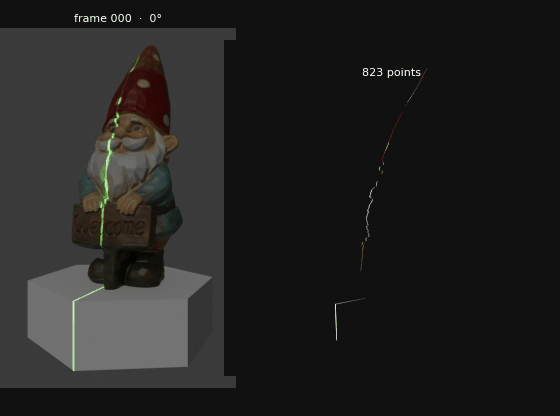
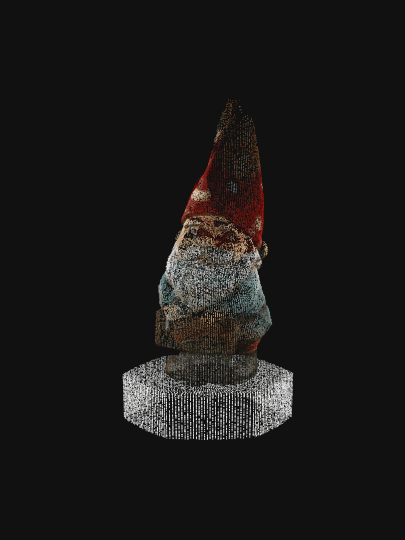
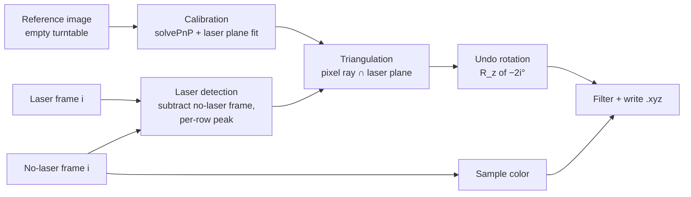
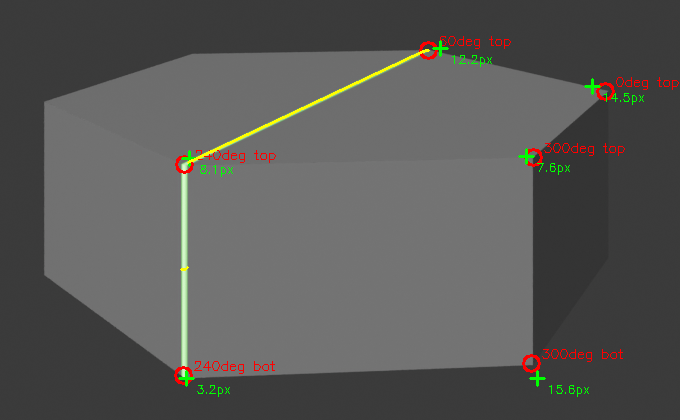
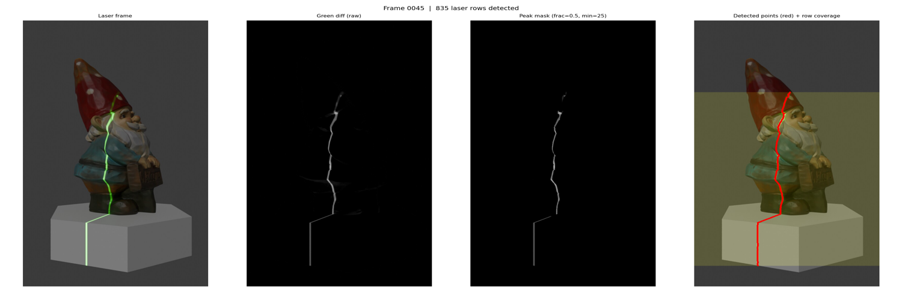
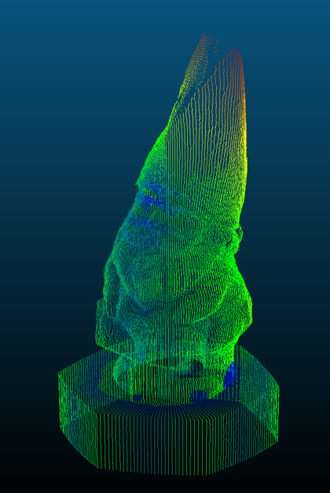
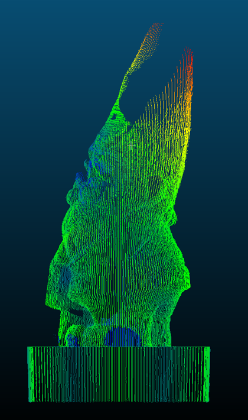
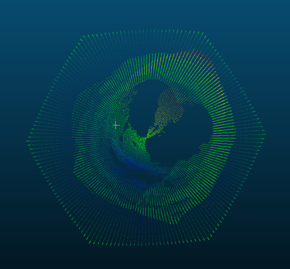

# 3D Laser Scanner Reconstruction

Rebuilds a colored 3D point cloud of a figurine from 180 photos taken by a (simulated) laser-line scanner: a fixed camera, a fixed green laser line, and a turntable that rotates the object 2° per photo.

<p align="center">
  <br>
  <em>Left: input frame with the laser line. Right: the point cloud growing as the turntable rotates.</em>
</p>

Everything from camera calibration to ray–plane triangulation is implemented by hand with NumPy and OpenCV. No 3D-reconstruction library is used.

| | |
|---|---|
| Input | 180 laser frames + 180 matching frames without the laser (720 × 1280 px) |
| Output | 156,748 colored points (`X Y Z R G B`) |
| Runtime | ~4 s for the full scan (Apple M1 Pro, single-threaded Python) |
| Accuracy vs. ground-truth mesh | median **3.2 mm**, mean 4.7 mm on an 83 mm-tall scene ([`evaluate.py`](evaluate.py)) |

<p align="center">
  
</p>

*Built as the final project for a university computer vision course. The scanner images and ground-truth mesh were provided with the assignment.*

---

## How it works



### 1. Calibration
The camera's pose is unknown. Six corners of the hexagonal turntable, whose 3D positions are known from its dimensions (25 mm radius, 15 mm thick), are picked in the reference image with a small zoomable picker ([`pick_calibration_pts.py`](pick_calibration_pts.py)). `cv2.solvePnP` then recovers the camera rotation and translation.

The laser plane passes through the rotation axis, so it has the form `ax + by = 0`. The laser line on the flat turntable top is projected into 3D (241 points on Z = 0), and an SVD line fit through the origin gives `0.879x − 0.477y = 0`.

<p align="center"><br>
<em>Red: picked corners. Green: solvePnP reprojections (per-corner error in px). Yellow: laser line used for the plane fit.</em></p>

### 2. Laser detection
Each laser frame is subtracted from its matching no-laser frame, leaving only the green laser. The stripe is nearly vertical, so each image **row** contributes the column of its brightest green difference, provided that peak exceeds a noise threshold.

<p align="center"><br>
<em>Raw frame → green difference → peak mask → detected points (red).</em></p>

This was the third version of the detector. Each change was driven by the debug views in [`debug_tools.py`](debug_tools.py):

| Version | Idea | Points | Problem |
|---|---|---|---|
| v1 | Threshold + weighted centroid per column | 22k–53k | No threshold worked for both dark boots and bright reflections |
| v2 | Brightest pixel per column | 44k | Capped at 720 samples per frame; curved stripe skips columns |
| **v3** | **Brightest pixel per row** | **157k** | 1280 samples per frame, stripe crosses every row it lights |

### 3. Triangulation and unrotation
Each detected pixel `(u, v)` becomes a camera ray `K⁻¹[u, v, 1]ᵀ`, which is rotated into world coordinates and intersected with the laser plane. The object turned by `θᵢ = 2i°`, so the point is rotated back by `−θᵢ` into the object's own frame. Its color comes from the same pixel in the no-laser frame.

A physical-bounds filter keeps points within the turntable radius (28 mm) and height range. It removed 12k false detections caused by specular reflections off the turntable edges.

## Accuracy

`evaluate.py` measures the distance from every reconstructed point to the nearest triangle of the ground-truth mesh (the same idea as CloudCompare's cloud-to-mesh distance):

```
Cloud -> mesh distance, all points  (156,748 points)
  mean 4.71 mm   median 3.23 mm   std 5.27 mm
  90th pct 9.99 mm   95th pct 16.53 mm
```

<p align="center">
  
  
  <br>
  <em>CloudCompare error map (blue = low, red = high). Error grows toward the tip of the hat.</em>
</p>

**Where the error comes from.** Most of it is a vertical stretch: the reconstruction reaches Z = 85 mm, but the ground truth tops out at 69 mm. A best-fit rigid alignment only lowers the nearest-point median from 5.5 to 4.5 mm, so this is shape distortion, not a simple offset. This points to the camera calibration, which has 9.8 px of reprojection error from six hand-picked corners, rather than the laser detector.

**Next steps:**
- Refine the corners to sub-pixel accuracy (`cv2.cornerSubPix`) and use more of them.
- Refit the laser plane with the improved camera pose.
- Add sub-pixel peak interpolation along each row.

## Running it

> **Data not included.** The scanner images and ground-truth mesh were provided with the course assignment and aren't mine to redistribute. The animations and figures above show the results. To run the pipeline on your own scan, arrange it like this:
>
> ```
> data/
> ├── 0000.jpg … 0179.jpg          laser frames, 2° turntable step
> ├── withoutLaser/0000.jpg …      same frames with the laser off
> ├── Reference.png                empty turntable with laser (calibration)
> └── ground_truth.ply             optional, for evaluate.py
> ```

```bash
pip install -r requirements.txt

python reconstruct.py     # → output.xyz  (~4 s)
python evaluate.py        # accuracy vs data/ground_truth.ply
python to_ply.py          # → output.ply for MeshLab / CloudCompare
python make_gifs.py       # regenerate the README animations in docs/

# debug views, written to debug/
python debug_tools.py laser --frame 45   # detection stages for one frame
python debug_tools.py calib              # calibration overlay
python debug_tools.py slice --frame 45   # one frame's 3D slice
python debug_tools.py cloud              # whole-cloud projections and histograms
```

## Repository layout

```
reconstruct.py            calibration, laser detection, triangulation, output
evaluate.py               point-to-mesh accuracy against the ground-truth mesh
debug_tools.py            visual checks for each pipeline stage
pick_calibration_pts.py   Tkinter tool for picking calibration corners with sub-pixel zoom
make_gifs.py              renders docs/*.gif
to_ply.py                 .xyz → binary .ply
DEVLOG.md                 development log: what was tried and why
data/                     input scan (not included, see Running it)
```
